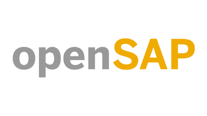

# Completed Courses

* [ABAP Development for SAP HANA](pdf/a4h1_ConfirmationOfParticipation.pdf)
* [AI Ethics at SAP (Edition Q12024)](pdf/aie1-2_RecordOfAchievement.pdf)
* [Building AI and Sustainability Solutions on SAP BTP](pdf/sustai1_RecordOfAchievement.pdf)
* [Developing and Extending SAP Fiori Elements Apps](pdf/fiori-ea1_RecordOfAchievement.pdf)
* [Efficient DevOps with SAP](pdf/devops1_RecordOfAchievement.pdf)
* [Gain Technical Knowledge on SAP S4HANA Cloud, Private Edition](pdf/s4cpe1_ConfirmationOfParticipation.pdf)
* [Generative AI at SAP](pdf/genai1_RecordOfAchievement.pdf)
* [Getting Started with SAP Fieldglass](pdf/fg2_RecordOfAchievement.pdf)
* [Introduction to ABAP in the Cloud](pdf/abap1_RecordOfAchievement.pdf)
* [Managing ABAP Systems on SAP NetWeaver](pdf/cst1_ConfirmationOfParticipation.pdf)
* [Next Steps in Software Development on SAP HANA](pdf/hana2_ConfirmationOfParticipation.pdf)
* [SAP Business Technology Platform in a Nutshell](pdf/btp1_RecordOfAchievement.pdf)
* [Software Development on SAP HANA (Delta SPS 11)](pdf/hana4_RecordOfAchievement.pdf)
* [Software Development on SAP HANA (Update Q12019)](pdf/hana7_RecordOfAchievement.pdf)
* [System Conversion to SAP S4HANA (Repeat)](pdf/s4h11-1_RecordOfAchievement.pdf)
* [What Can Blockchain Do for You](pdf/block1_RecordOfAchievement.pdf)
* [Writing Testable Code for ABAP](pdf/wtc1_RecordOfAchievement.pdf)
